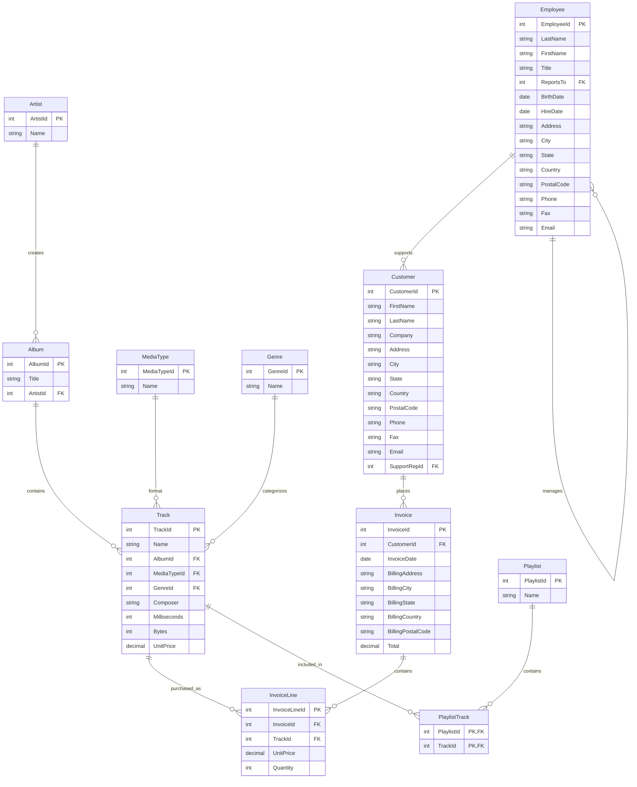

# Chinook Database Model

This document explains the Chinook database model used in this demo application. The Chinook database represents a digital media store (similar to iTunes), including tables for artists, albums, tracks, and more.

## Complete Database Schema



## Entity Descriptions

### Artist

Represents music artists (bands or individuals) who create albums.

**Fields**:

- `ArtistId`: Unique identifier (Primary Key)
- `Name`: Artist name

**Model Class**: `Artist.java`

```java
@Table(
        zone = @Zone(value = "Chinook", storageProfiles = "default")
)
public class Artist {
    @Id
    @Column(value = "ArtistId", nullable = false)
    private Integer artistId;

    @Column(value = "Name", nullable = true)
    private String name;
    
    // Methods omitted for brevity
}
```

### Album

Represents music albums created by artists.

**Fields**:

- `AlbumId`: Unique identifier (Primary Key)
- `Title`: Album title
- `ArtistId`: Reference to the Artist (Foreign Key)

**Model Class**: `Album.java`

```java
@Table(
        zone = @Zone(value = "Chinook", storageProfiles = "default"),
        colocateBy = @ColumnRef("ArtistId"),
        indexes = {
            @Index(value = "IFK_AlbumArtistId", columns = { @ColumnRef("ArtistId") })
        }
)
public class Album {
    @Id
    @Column(value = "AlbumId", nullable = false)
    private Integer albumId;

    @Column(value = "Title", nullable = false)
    private String title;

    @Id
    @Column(value = "ArtistId", nullable = false)
    private Integer artistId;
    
    // Methods omitted for brevity
}
```

### Track

Represents individual songs or compositions on an album.

**Fields**:

- `TrackId`: Unique identifier (Primary Key)
- `Name`: Track name
- `AlbumId`: Reference to the Album (Foreign Key)
- `MediaTypeId`: Reference to the MediaType (Foreign Key)
- `GenreId`: Reference to the Genre (Foreign Key)
- `Composer`: Name of the composer
- `Milliseconds`: Track length in milliseconds
- `Bytes`: Track size in bytes
- `UnitPrice`: Price of the track

**Model Class**: `Track.java`

```java
@Table(
        zone = @Zone(value = "Chinook", storageProfiles = "default"),
        colocateBy = @ColumnRef("AlbumId"),
        indexes = {
            @Index(value = "IFK_TrackAlbumId", columns = { @ColumnRef("AlbumId") }),
            @Index(value = "IFK_TrackGenreId", columns = { @ColumnRef("GenreId") }),
            @Index(value = "IFK_TrackMediaTypeId", columns = { @ColumnRef("MediaTypeId") })
        }
)
public class Track {
    @Id
    @Column(value = "TrackId", nullable = false)
    private Integer trackId;

    @Column(value = "Name", nullable = false)
    private String name;

    @Id
    @Column(value = "AlbumId", nullable = true)
    private Integer albumId;

    @Column(value = "MediaTypeId", nullable = false)
    private Integer mediaTypeId;

    @Column(value = "GenreId", nullable = true)
    private Integer genreId;

    @Column(value = "Composer", nullable = true)
    private String composer;

    @Column(value = "Milliseconds", nullable = false)
    private Integer milliseconds;

    @Column(value = "Bytes", nullable = true)
    private Integer bytes;

    @Column(value = "UnitPrice", nullable = false)
    private BigDecimal unitPrice;
    
    // Methods omitted for brevity
}
```

### Genre

Represents music genres for classification.

**Fields**:

- `GenreId`: Unique identifier (Primary Key)
- `Name`: Genre name

**Model Class**: `Genre.java`

```java
@Table(
        zone = @Zone(value = "ChinookReplicated", storageProfiles = "default")
)
public class Genre {
    @Id
    @Column(value = "GenreId", nullable = false)
    private Integer genreId;

    @Column(value = "Name", nullable = true)
    private String name;
    
    // Methods omitted for brevity
}
```

### MediaType

Represents different media formats (e.g., MPEG, AAC).

**Fields**:

- `MediaTypeId`: Unique identifier (Primary Key)
- `Name`: Media type name

**Model Class**: `MediaType.java`

```java
@Table(
        zone = @Zone(value = "ChinookReplicated", storageProfiles = "default")
)
public class MediaType {
    @Id
    @Column(value = "MediaTypeId", nullable = false)
    private Integer mediaTypeId;

    @Column(value = "Name", nullable = true)
    private String name;
    
    // Methods omitted for brevity
}
```

## Distribution Strategy

The Chinook model uses two different distribution zones:

1. **Chinook Zone (2 replicas)**:
   - `Artist`: Primary entity
   - `Album`: Co-located with Artist by ArtistId
   - `Track`: Co-located with Album by AlbumId
   - `Customer`: Primary entity for business data
   - `Invoice`: Co-located with Customer by CustomerId
   - `InvoiceLine`: Co-located with Invoice by InvoiceId
   - `Employee`: Primary entity for employee data
   - `Playlist`: Primary entity
   - `PlaylistTrack`: Co-located with Playlist by PlaylistId

2. **ChinookReplicated Zone (3 replicas)**:
   - `Genre`: Reference data, frequently read
   - `MediaType`: Reference data, frequently read

## Co-location Strategy

This model demonstrates a hierarchical co-location strategy:

1. `Artist` is the root entity
2. `Album` is co-located with the corresponding `Artist`
3. `Track` is co-located with the corresponding `Album`

Similarly for business data:

1. `Customer` is the root entity
2. `Invoice` is co-located with the corresponding `Customer`
3. `InvoiceLine` is co-located with the corresponding `Invoice`

And for playlists:

1. `Playlist` is the root entity
2. `PlaylistTrack` is co-located with the corresponding `Playlist`

This ensures that when you query data across these entities (e.g., all tracks by a specific artist), the data is already located on the same physical node, minimizing network transfers and improving performance.

## Schema Creation

There are two ways to create this schema in the application:

### 1. POJO-based Creation (Using Java Annotations)

With this approach, you define Java classes with appropriate annotations, and then use the Ignite Catalog API to create tables:

```java
// Create a table from an annotated class
client.catalog().createTable(Artist.class);
```

This is implemented in `TableUtils.createTables()` method.

### 2. SQL-based Creation (Using the BulkLoadApp)

With this approach, you define the schema in SQL and use the `BulkLoadApp` to execute SQL statements:

```sql
-- Create a distribution zone
CREATE ZONE IF NOT EXISTS Chinook 
WITH STORAGE_PROFILES='default', REPLICAS=2;

-- Create the Artist table
CREATE TABLE Artist (
    ArtistId INT PRIMARY KEY,
    Name VARCHAR
) ZONE Chinook;

-- Create the Album table with co-location
CREATE TABLE Album (
    AlbumId INT,
    Title VARCHAR NOT NULL,
    ArtistId INT,
    PRIMARY KEY (AlbumId, ArtistId)
) ZONE Chinook COLOCATE BY (ArtistId);
```

The SQL-based approach preserves the same relationships, co-location strategy, and distribution zones as the POJO-based approach.

## Example Queries

Here are some example queries that demonstrate the relationships between entities:

### Finding Albums by Artist

```java
client.sql().execute(null,
        "SELECT a.Title, ar.Name as ArtistName " +
        "FROM Album a JOIN Artist ar ON a.ArtistId = ar.ArtistId " +
        "WHERE ar.Name = ?", artistName)
```

### Finding Tracks with Album and Artist Information

```java
client.sql().execute(null,
        "SELECT t.Name as Track, t.Composer, a.Title as Album, ar.Name as Artist " +
        "FROM Track t " +
        "JOIN Album a ON t.AlbumId = a.AlbumId " +
        "JOIN Artist ar ON a.ArtistId = ar.ArtistId " +
        "WHERE ar.Name = ?", artistName)
```

### Finding Customer Purchases

```java
client.sql().execute(null,
        "SELECT c.FirstName, c.LastName, i.InvoiceDate, SUM(il.UnitPrice * il.Quantity) as Total " +
        "FROM Customer c " +
        "JOIN Invoice i ON c.CustomerId = i.CustomerId " +
        "JOIN InvoiceLine il ON i.InvoiceId = il.InvoiceId " +
        "GROUP BY c.CustomerId, i.InvoiceId " +
        "ORDER BY i.InvoiceDate DESC")
```

### Finding Tracks in Playlists

```java
client.sql().execute(null,
        "SELECT p.Name as Playlist, t.Name as Track, ar.Name as Artist " +
        "FROM PlaylistTrack pt " +
        "JOIN Playlist p ON pt.PlaylistId = p.PlaylistId " +
        "JOIN Track t ON pt.TrackId = t.TrackId " +
        "JOIN Album a ON t.AlbumId = a.AlbumId " +
        "JOIN Artist ar ON a.ArtistId = ar.ArtistId " +
        "WHERE p.Name = ?", playlistName)
```

## Using the Model Classes

The model classes are used throughout the application for data operations:

### Creating a New Artist

```java
Artist queen = new Artist(6, "Queen");
Table artistTable = client.tables().table("Artist");
RecordView<Artist> artistView = artistTable.recordView(Artist.class);
artistView.upsert(null, queen);
```

### Creating a New Album

```java
Album newAlbum = new Album(6, "A Night at the Opera", 6);
Table albumTable = client.tables().table("Album");
RecordView<Album> albumView = albumTable.recordView(Album.class);
albumView.upsert(null, newAlbum);
```

### Creating Tracks

```java
Track track1 = new Track(
        6,
        "Bohemian Rhapsody",
        6,
        1,
        1,
        "Freddie Mercury",
        354947,
        5733664,
        new BigDecimal("0.99")
);

Table trackTable = client.tables().table("Track");
RecordView<Track> trackView = trackTable.recordView(Track.class);
trackView.upsert(null, track1);
```

## Using Transactions for Related Data

The application demonstrates using transactions to ensure consistency when creating related entities:

```java
client.transactions().runInTransaction(tx -> {
    // Create a new artist
    Artist newArtist = new Artist(7, "Pink Floyd");
    artistView.upsert(tx, newArtist);

    // Create a new album for this artist
    Album newAlbum = new Album(8, "The Dark Side of the Moon", 7);
    albumView.upsert(tx, newAlbum);

    // Create tracks for this album
    List<Track> newTracks = ChinookUtils.createSampleTracks(8, 10);
    trackView.upsertAll(tx, newTracks);
    
    return true;
});
```
