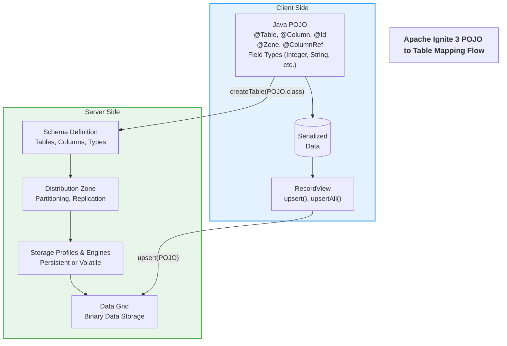

# POJO to Table Mapping in Apache Ignite 3

This document explains how Plain Old Java Objects (POJOs) are mapped to tables in Apache Ignite 3, including the data flow from client to server and how your data is stored in the distributed grid.

## POJO-to-Table Mapping Flow



## How It Works

### 1. Schema Definition via Annotations

Java POJOs are decorated with Ignite annotations to define the schema:

- `@Table`: Marks a class as an Ignite table and defines properties like zone, co-location, and indexes.
- `@Column`: Maps Java fields to table columns with specific properties
- `@Id`: Marks fields that form the primary key
- `@Zone`: Specifies which distribution zone the table belongs to
- `@ColumnRef`: References columns for co-location purposes

Example from `Artist.java`:

```java
@Table(
        zone = @Zone(value = "Chinook", storageProfiles = "default"),
        colocateBy = @ColumnRef("ArtistId"),
        indexes = {
            @Index(value = "IFK_AlbumArtistId", columns = { @ColumnRef("ArtistId") })
        }
)
public class Album {
    // Primary key field
    @Id
    @Column(value = "AlbumId", nullable = false)
    private Integer albumId;

    @Column(value = "Title", nullable = false)
    private String title;

    // Foreign key to Artist table
    @Id
    @Column(value = "ArtistId", nullable = false)
    private Integer artistId;
    
    // Methods omitted for brevity
}
```

### 2. Table Creation

When you call `client.catalog().createTable(Artist.class)`:

1. Ignite scans the annotations in your POJO class
2. Creates a corresponding table schema in the distributed catalog
3. Assigns the table to a distribution zone based on the `@Zone` annotation
4. Configures storage using the specified storage profile
5. Prepares partitioning and replication based on the zone configuration

The actual implementation happens in `TableUtils.java`:

```java
// Use IgniteCatalog.createTable to create tables from annotated classes
System.out.println("--- Creating Artist table");
client.catalog().createTable(Artist.class);
```

### 3. Data Storage

When you insert data using `recordView.upsert(artist)`:

1. The POJO is serialized into Ignite's binary format
2. The binary data is distributed according to the partitioning strategy defined in the zone
3. For co-located tables, related records are stored on the same cluster nodes
4. Data is replicated across multiple nodes according to the zone's replica count
5. The storage engine defined by the storage profile handles the physical storage

The implementation in `ChinookUtils.java`:

```java
public static boolean addArtist(IgniteClient client, Artist artist) {
    try {
        // Get the Artist table
        Table artistTable = client.tables().table("Artist");
        // Create a record view for Artist class
        RecordView<Artist> artistView = artistTable.recordView(Artist.class);
        // Insert the artist
        artistView.upsert(null, artist);
        System.out.println("Added artist: " + artist.getName());
        return true;
    } catch (Exception e) {
        System.err.println("Error adding artist: " + e.getMessage());
        return false;
    }
}
```

### 4. Java Type to Column Type Mapping

| Java Type | Ignite Column Type |
|-----------|-------------------|
| Integer, int | INT |
| Long, long | BIGINT |
| String | VARCHAR |
| BigDecimal | DECIMAL |
| Boolean, boolean | BOOLEAN |
| java.sql.Date | DATE |
| java.sql.Timestamp | TIMESTAMP |
| byte[] | BINARY |

### 5. Distribution Zones and Storage Profiles

In Ignite 3, distribution zones and storage profiles work together to control how data is distributed and stored:

- **Distribution Zones**: Define partitioning and replication strategies
  - In this Chinook demo, we use:
    - `Chinook` zone: Primary entity tables with 2 replicas
    - `ChinookReplicated` zone: Reference tables with 3 replicas

- **Storage Profiles**: Define which storage engine to use and its configuration
  - Available engines:
    - Apache Ignite Page Memory (B+ tree) - persistent or volatile (in-memory)
    - RocksDB - optimized for write-heavy workloads

- **Co-location**: Related entities are stored together on the same node when you use `colocateBy = @ColumnRef("ArtistId")`, improving join performance.

Example of co-location in `Album.java`:

```java
@Table(
        zone = @Zone(value = "Chinook", storageProfiles = "default"),
        colocateBy = @ColumnRef("ArtistId")
)
public class Album {
    @Id
    @Column(value = "AlbumId", nullable = false)
    private Integer albumId;

    @Column(value = "Title", nullable = false)
    private String title;

    @Id
    @Column(value = "ArtistId", nullable = false)
    private Integer artistId;
    
    // Methods omitted for brevity
}
```

### 6. Behind the Scenes: Server-Side Processing

When your POJO data reaches the Ignite cluster:

1. **Distribution Zone Processing**: The zone determines how data is partitioned and replicated
2. **Partitioning**: Each record is assigned to a specific partition based on a hash of its primary key or co-location key
3. **Distribution**: The partitions are distributed across the cluster nodes according to the zone configuration
4. **Replication**: Data is replicated to additional nodes based on the zone's replica count
5. **Storage Engine Processing**: The configured storage engine (defined by the storage profile) handles the physical storage
6. **Indexing**: Indexes are created and maintained for efficient querying
7. **Storage**: Data is persisted according to the storage engine's format (B+ tree or LSM-tree)

## POJO-based vs. SQL-based Table Creation

Ignite 3 supports two approaches for creating tables and managing data:

### POJO-based Approach (Java APIs)

```java
// Create the Artist table from a POJO
client.catalog().createTable(Artist.class);

// Create and insert an Artist instance
Artist artist = new Artist(1, "AC/DC");
Table artistTable = client.tables().table("Artist");
RecordView<Artist> artistView = artistTable.recordView(Artist.class);
artistView.upsert(null, artist);
```

### SQL-based Approach (SQL Statements)

```sql
-- Create the Artist table using SQL
CREATE TABLE Artist (
    ArtistId INT PRIMARY KEY,
    Name VARCHAR
) ZONE Chinook STORAGE PROFILE 'default';

-- Insert an artist using SQL
INSERT INTO Artist (ArtistId, Name) VALUES (1, 'AC/DC');
```

### Comparison

| Feature | POJO-based | SQL-based (BulkLoadApp) |
|---------|------------|-------------------------|
| Schema Definition | Java annotations | SQL statements |
| Type Safety | Compile-time checking | Runtime checking |
| Ease of Use | Object-oriented | Familiar SQL syntax |
| Performance | Direct binary format | SQL parsing overhead |
| Bulk Operations | `upsertAll()` method | SQL batch inserts |
| Flexibility | Java object manipulation | SQL's expressiveness |
| Learning Curve | Java and annotations | SQL knowledge |
| Implementation | CreateTablesApp, LoadDataApp | BulkLoadApp |

Both approaches create the same underlying table structure and support the same operations. You can even mix approaches, creating tables with SQL and then using Java APIs to operate on them, or vice versa.

## Benefits of This Approach

1. **Type Safety**: Java's type system ensures data integrity before it reaches the cluster
2. **Reduced Boilerplate**: No manual mapping between Java objects and database operations
3. **Optimized Data Locality**: Co-location ensures related data is stored together for faster joins
4. **Scalability**: Proper partitioning allows the cluster to scale horizontally
5. **Resilience**: Replication ensures data availability even if some nodes fail
6. **Storage Flexibility**: Different storage engines can be chosen based on workload characteristics

## Tuning Considerations

1. **Zone Configuration**: Balance between data redundancy (replicas) and storage efficiency
2. **Storage Profile Selection**: Choose appropriate storage engine based on read/write patterns
3. **Co-location Strategy**: Choose co-location keys based on common query patterns
4. **Data Types**: Select appropriate Java types considering storage and performance implications
5. **Partition Count**: Affects distribution granularity and rebalancing operations

## Examples

### Example 1: Creating and inserting a simple entity with SQL

```sql
-- Create a distribution zone
CREATE ZONE IF NOT EXISTS ExampleZone 
WITH STORAGE_PROFILES='default', PARTITIONS=20, REPLICAS=2;

-- Create a table in the zone
CREATE TABLE Artist (
    ArtistId INT PRIMARY KEY,
    Name VARCHAR
) ZONE ExampleZone;

-- Insert data
INSERT INTO Artist VALUES (1, 'AC/DC');
```

### Example 2: Java POJO with annotations for co-location

```java
// Define a co-located entity
@Table(
        zone = @Zone(value = "Chinook", storageProfiles = "default"),
        colocateBy = @ColumnRef("ArtistId")
)
public class Album {
    @Id
    @Column(value = "AlbumId", nullable = false)
    private Integer albumId;
    
    @Column(value = "Title", nullable = false)
    private String title;
    
    @Id
    @Column(value = "ArtistId", nullable = false)
    private Integer artistId;
    
    // Constructors, getters, setters...
}

// Create the table and insert related entities
client.catalog().createTable(Album.class);

Artist artist = new Artist(1, "AC/DC");
Album album = new Album(1, "Back in Black", 1);

// Add the artist
artistView.upsert(null, artist);

// Add the album - will be co-located with the artist
albumView.upsert(null, album);
```

### Example 3: Using transactions for related entities

```java
// Create multiple related entities in a transaction
client.transactions().runInTransaction(tx -> {
    // Create artist
    Artist queen = new Artist(6, "Queen");
    artistView.upsert(tx, queen);
    
    // Create album
    Album album = new Album(6, "A Night at the Opera", 6);
    albumView.upsert(tx, album);
    
    // Create tracks
    Track track1 = new Track(6, "Bohemian Rhapsody", 6, 1, 1, 
        "Freddie Mercury", 354947, 5733664, new BigDecimal("0.99"));
    Track track2 = new Track(7, "You're My Best Friend", 6, 1, 1,
        "John Deacon", 175733, 2875239, new BigDecimal("0.99"));
    
    List<Track> tracks = Arrays.asList(track1, track2);
    trackView.upsertAll(tx, tracks);
    
    return true;
});
```

## Further Reading

- [Apache Ignite 3 Java API Documentation](https://ignite.apache.org/docs/ignite3/latest/)
- [Distribution Zones in Ignite 3](./distribution-zones.md)
- [Storage Profiles and Engines](./storage-profiles.md)
- [Bulk Loading in Ignite 3](./bulk-load.md)
- [Ignite 3 Annotations Reference](./annotations.md)
