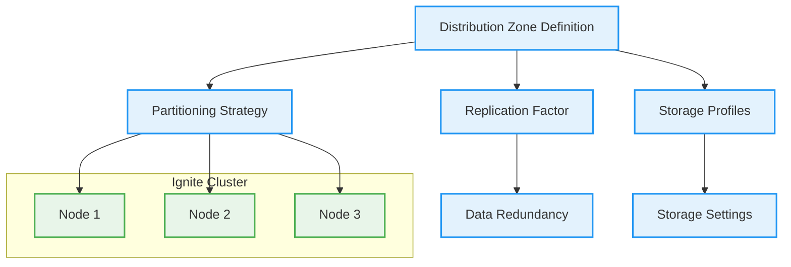
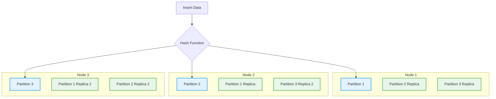

# Understanding Distribution Zones in Apache Ignite 3

This document explains distribution zones in Apache Ignite 3, a critical concept for effective data management in a distributed environment.

## What Are Distribution Zones?

Distribution zones in Apache Ignite 3 define how data is distributed and replicated across the cluster. They control important aspects of data placement such as:

- **Partitioning**: How data is split across nodes
- **Replication**: How many copies of each partition exist
- **Storage profiles**: Which storage methods are used



## Distribution Zones in the Chinook Demo

The Chinook demo defines two distribution zones:

1. **Chinook**: For primary entity tables with 2 replicas
2. **ChinookReplicated**: For reference tables with 3 replicas

These are defined in `TableUtils.java`:

```java
// Create the Chinook distribution zone with 2 replicas
ZoneDefinition zoneChinook = ZoneDefinition.builder("Chinook")
        .ifNotExists()
        .replicas(2)
        .storageProfiles("default")
        .build();

// Create the ChinookReplicated distribution zone with 3 replicas and 25 partitions
ZoneDefinition zoneChinookReplicated = ZoneDefinition.builder("ChinookReplicated")
        .ifNotExists()
        .replicas(3)
        .partitions(25)
        .storageProfiles("default")
        .build();
```

Tables are assigned to zones using the `@Zone` annotation:

```java
@Table(
        zone = @Zone(value = "Chinook", storageProfiles = "default")
)
public class Artist {
    // Class body...
}
```

## Zone Configuration Options

### Replicas

The `replicas` parameter defines how many copies of each partition are stored across the cluster. For example:

- `replicas(1)`: No redundancy (data exists on only one node)
- `replicas(2)`: One backup copy exists (data exists on two nodes)
- `replicas(3)`: Two backup copies exist (data exists on three nodes)

Higher replica counts increase fault tolerance but consume more storage space.

### Partitions

The `partitions` parameter defines how many partitions the data is split into:

```java
.partitions(25)
```

More partitions allow for finer-grained distribution but increase overhead. The default is typically 256 partitions, which is suitable for most use cases.

### Storage Profiles

Storage profiles define how data is physically stored:

```java
.storageProfiles("default")
```

In Ignite 3, storage profiles define a storage engine and its configuration parameters. Currently, Ignite 3 supports these storage engines:

- Apache Ignite Page Memory (B+ tree) - available in both persistent and volatile (in-memory) variants
- RocksDB - a persistent storage based on Log-structured Merge-tree (LSM) optimized for write-heavy workloads

You can configure different storage profiles with various parameters such as checkpoint frequency, page size, and memory allocation based on your workload needs.

## Zone Assignment Strategy

### Primary Tables: Chinook Zone

Tables with complex relationships and frequent updates are assigned to the `Chinook` zone with 2 replicas:

- `Artist.java`: Music artists
- `Album.java`: Music albums
- `Track.java`: Music tracks

```java
@Table(
    zone = @Zone(value = "Chinook", storageProfiles = "default")
)
public class Artist {
    // Class body...
}
```

### Reference Tables: ChinookReplicated Zone

Tables that are mostly read-only and used for lookups are assigned to the `ChinookReplicated` zone with 3 replicas:

- `Genre.java`: Music genres
- `MediaType.java`: Media format types

```java
@Table(
    zone = @Zone(value = "ChinookReplicated", storageProfiles = "default")
)
public class Genre {
    // Class body...
}
```

## Data Placement Visualization

When data is inserted, it's distributed according to the zone configuration:



## Co-location and Zones

Co-location works within a distribution zone, ensuring that related data ends up on the same node:

```java
@Table(
    zone = @Zone(value = "Chinook", storageProfiles = "default"),
    colocateBy = @ColumnRef("ArtistId")
)
public class Album {
    // Class body...
}
```

This ensures that when you join `Artist` and `Album` tables, the data is already located on the same node, reducing network transfers.

## Creating Zones Programmatically

The demo creates zones programmatically in `TableUtils.java`:

```java
public static boolean createDistributionZones(IgniteClient client) {
    try {
        System.out.println("\n=== Creating Distribution Zones");

        // Create the Chinook distribution zone with 2 replicas
        ZoneDefinition zoneChinook = ZoneDefinition.builder("Chinook")
                .ifNotExists()
                .replicas(2)
                .storageProfiles("default")
                .build();
        System.out.println("--- Creating Distribution Zone: " + zoneChinook);
        client.catalog().createZone(zoneChinook);

        // Create the ChinookReplicated distribution zone with 3 replicas and 25 partitions
        ZoneDefinition zoneChinookReplicated = ZoneDefinition.builder("ChinookReplicated")
                .ifNotExists()
                .replicas(3)
                .partitions(25)
                .storageProfiles("default")
                .build();
        System.out.println("--- Creating Distribution Zone: " + zoneChinookReplicated);
        client.catalog().createZone(zoneChinookReplicated);

        System.out.println("=== Distribution zones created successfully");
        return true;
    } catch (Exception e) {
        System.err.println("Error creating distribution zones: " + e.getMessage());
        return false;
    }
}
```

## Zone Considerations and Best Practices

### Performance Considerations

- **Read-Heavy Workloads**: Use more replicas to distribute read operations
- **Write-Heavy Workloads**: Fewer replicas reduce write overhead
- **Balanced Workloads**: 2 replicas is often a good compromise

### Data Size Considerations

- **Small Reference Data**: Can use more replicas (like `ChinookReplicated`)
- **Large Data Sets**: Consider fewer replicas to reduce storage costs

### Availability Considerations

- **Critical Data**: Use more replicas (3+) for higher availability
- **Transient Data**: Fewer replicas may be acceptable

### Zone Evolution

As your application evolves, you may need to adjust zones:

- Start with 2 replicas for most zones
- Monitor performance and adjust as needed
- Consider creating specialized zones for specific workloads

## Monitoring Zone Usage

You can monitor zone usage using Ignite's monitoring tools:

- Number of partitions per node
- Data size per zone
- Read/write operations per zone

## Further Reading

- [Apache Ignite 3 Distribution Documentation](https://ignite.apache.org/docs/latest/concepts/distributed-data)
- [Ignite 3.0 Storage Architecture](https://ignite.apache.org/docs/latest/concepts/storage)
- [Replication and High Availability in Ignite 3](https://ignite.apache.org/docs/latest/concepts/high-availability)