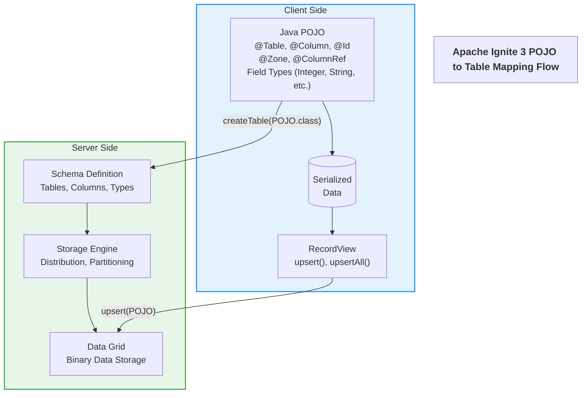

# POJO to Table Mapping in Apache Ignite 3

This document explains how Plain Old Java Objects (POJOs) are mapped to tables in Apache Ignite 3, including the data flow from client to server and how your data is stored in the distributed grid.

## POJO-to-Table Mapping Flow



## How It Works

### 1. Schema Definition via Annotations

Java POJOs are decorated with Ignite annotations to define the schema:

- `@Table`: Marks a class as an Ignite table and defines properties like zone and co-location
- `@Column`: Maps Java fields to table columns with specific properties
- `@Id`: Marks fields that form the primary key
- `@Zone`: Specifies which distribution zone the table belongs to
- `@ColumnRef`: References columns for co-location purposes

Example from `Artist.java`:
```java
@Table(
        zone = @Zone(value = "Chinook", storageProfiles = "default")
)
public class Artist {
    @Id
    @Column(value = "ArtistId", nullable = false)
    private Integer artistId;

    @Column(value = "Name", nullable = true)
    private String name;
    
    // Methods omitted for brevity
}
```

### 2. Table Creation

When you call `client.catalog().createTable(Artist.class)`:

1. Ignite scans the annotations in your POJO class
2. Creates a corresponding table schema in the distributed catalog
3. Sets up storage structures according to the zone definition
4. Prepares partitioning and replication based on the zone configuration

The actual implementation happens in `TableUtils.java`:

```java
// Use IgniteCatalog.createTable to create tables from annotated classes
System.out.println("--- Creating Artist table");
client.catalog().createTable(Artist.class);
```

### 3. Data Storage

When you insert data using `recordView.upsert(artist)`:

1. The POJO is serialized into Ignite's binary format
2. The binary data is distributed according to the partitioning strategy
3. For co-located tables, related records are stored on the same cluster nodes
4. Data is replicated across multiple nodes according to the replica count

The implementation in `ChinookUtils.java`:

```java
public static boolean addArtist(IgniteClient client, Artist artist) {
    try {
        // Get the Artist table
        Table artistTable = client.tables().table("Artist");
        // Create a record view for Artist class
        RecordView<Artist> artistView = artistTable.recordView(Artist.class);
        // Insert the artist
        artistView.upsert(null, artist);
        System.out.println("Added artist: " + artist.getName());
        return true;
    } catch (Exception e) {
        System.err.println("Error adding artist: " + e.getMessage());
        return false;
    }
}
```

### 4. Java Type to Column Type Mapping

| Java Type | Ignite Column Type |
|-----------|-------------------|
| Integer, int | INT |
| Long, long | BIGINT |
| String | VARCHAR |
| BigDecimal | DECIMAL |
| Boolean, boolean | BOOLEAN |
| java.sql.Date | DATE |
| java.sql.Timestamp | TIMESTAMP |
| byte[] | BINARY |

### 5. Distribution and Co-location

- **Distribution Zones**: Control how your data is partitioned and replicated. In this Chinook demo, we use:
  - `Chinook` zone: Primary entity tables with 2 replicas
  - `ChinookReplicated` zone: Reference tables with 3 replicas

- **Co-location**: Related entities are stored together on the same node when you use `@Table(colocateBy = @ColumnRef("ArtistId"))`, improving join performance.

Example of co-location in `Album.java`:

```java
@Table(
        zone = @Zone(value = "Chinook", storageProfiles = "default"),
        colocateBy = @ColumnRef("ArtistId")
)
public class Album {
    @Id
    @Column(value = "AlbumId", nullable = false)
    private Integer albumId;

    @Column(value = "Title", nullable = false)
    private String title;

    @Id
    @Column(value = "ArtistId", nullable = false)
    private Integer artistId;
    
    // Methods omitted for brevity
}
```

### 6. Behind the Scenes: Server-Side Processing

When your POJO data reaches the Ignite cluster:

1. **Partitioning**: Each record is assigned to a specific partition based on a hash of its primary key or co-location key
2. **Distribution**: The partitions are distributed across the cluster nodes according to the zone configuration
3. **Replication**: Data is replicated to additional nodes based on the replica count
4. **Indexing**: Indexes are created and maintained for efficient querying
5. **Storage**: Data is persisted in the storage engine using a columnar format for efficient access

## Benefits of This Approach

1. **Type Safety**: Java's type system ensures data integrity before it reaches the cluster
2. **Reduced Boilerplate**: No manual mapping between Java objects and database operations
3. **Optimized Data Locality**: Co-location ensures related data is stored together for faster joins
4. **Scalability**: Proper partitioning allows the cluster to scale horizontally
5. **Resilience**: Replication ensures data availability even if some nodes fail

## Tuning Considerations

1. **Zone Configuration**: Balance between data redundancy (replicas) and storage efficiency
2. **Co-location Strategy**: Choose co-location keys based on common query patterns
3. **Data Types**: Select appropriate Java types considering storage and performance implications
4. **Partition Count**: Affects distribution granularity and rebalancing operations

## Examples

### Example 1: Creating and inserting a simple entity

```java
// Define the entity with annotations
@Table(zone = @Zone(value = "Chinook", storageProfiles = "default"))
public class Artist {
    @Id
    @Column(value = "ArtistId", nullable = false)
    private Integer artistId;
    
    @Column(value = "Name", nullable = true)
    private String name;
    
    // Constructors, getters, setters...
}

// Create the table in the catalog
client.catalog().createTable(Artist.class);

// Insert an entity
Artist artist = new Artist(1, "AC/DC");
Table artistTable = client.tables().table("Artist");
RecordView<Artist> artistView = artistTable.recordView(Artist.class);
artistView.upsert(null, artist);
```

### Example 2: Creating co-located entities

```java
// Define a co-located entity
@Table(
        zone = @Zone(value = "Chinook", storageProfiles = "default"),
        colocateBy = @ColumnRef("ArtistId")
)
public class Album {
    @Id
    @Column(value = "AlbumId", nullable = false)
    private Integer albumId;
    
    @Column(value = "Title", nullable = false)
    private String title;
    
    @Id
    @Column(value = "ArtistId", nullable = false)
    private Integer artistId;
    
    // Constructors, getters, setters...
}

// Insert related entities
Artist artist = new Artist(1, "AC/DC");
Album album = new Album(1, "Back in Black", 1);

// Add the artist
artistView.upsert(null, artist);

// Add the album - will be co-located with the artist
albumView.upsert(null, album);
```

## Further Reading

- [Apache Ignite 3 Java API Documentation](https://ignite.apache.org/docs/latest/table-api/java)
- [Distribution and Partitioning in Ignite 3](https://ignite.apache.org/docs/latest/concepts/distributed-data)
- [Ignite 3 Storage Architecture](https://ignite.apache.org/docs/latest/concepts/storage)
