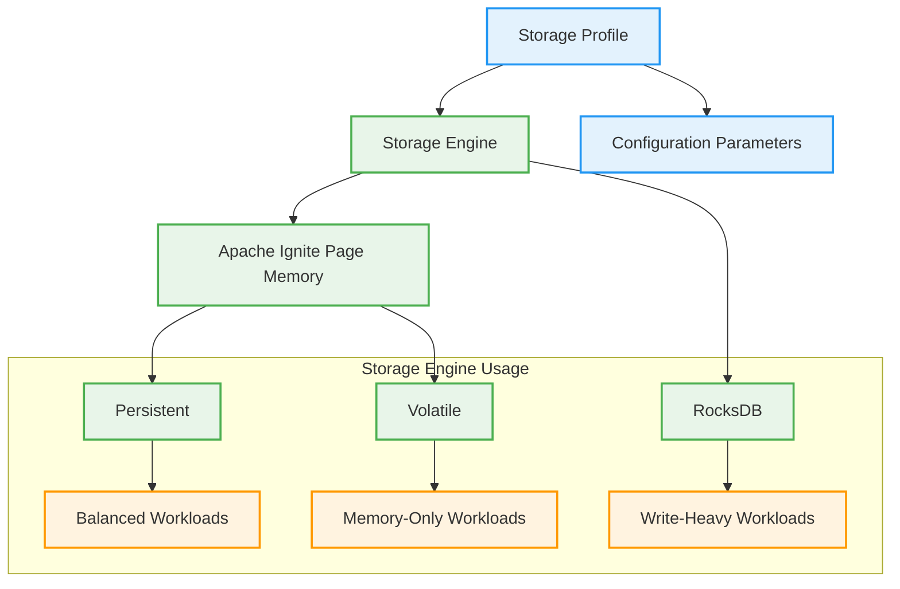

# Storage Profiles in Apache Ignite 3

This document explains the concept of storage profiles in Apache Ignite 3, their relationship with storage engines, and how to use them effectively.

## What Are Storage Profiles?

Storage profiles in Apache Ignite 3 define which storage engine to use and its configuration parameters. Storage profiles are a key component of the Ignite 3 architecture that:

- Define how data is physically stored
- Determine whether storage is persistent or volatile
- Configure storage engine-specific parameters
- Are associated with distribution zones and tables



## Supported Storage Engines

Apache Ignite 3 currently supports two main storage engines:

1. **Apache Ignite Page Memory (B+ tree)**
   - Available in two variants:
     - Persistent with in-memory caching layer
     - Fully in-memory (volatile)
   - Good for balanced workloads and read-intensive applications
   - Default engine for Ignite 3

2. **RocksDB (LSM-tree)**
   - Persistent only
   - Optimized for write-heavy workloads
   - Industry standard for high-write scenarios

## The Default Storage Profile

By default, Ignite 3 creates a storage profile named `default` that uses the persistent Apache Ignite Page Memory (aipersist) storage engine.

## Relationship to Distribution Zones

Distribution zones must be configured with one or more storage profiles:

```java
// Create a distribution zone with the default storage profile
ZoneDefinition zoneChinook = ZoneDefinition.builder("Chinook")
        .ifNotExists()
        .replicas(2)
        .storageProfiles("default")
        .build();
```

Or in SQL:

```sql
CREATE ZONE IF NOT EXISTS Chinook 
WITH STORAGE_PROFILES='default', REPLICAS=2;
```

A distribution zone can be configured to use multiple storage profiles:

```sql
CREATE ZONE IF NOT EXISTS ExampleZone 
WITH STORAGE_PROFILES='profile1,profile2,profile3', REPLICAS=2;
```

## Assigning Storage Profiles to Tables

When creating a table, you specify which storage profile to use:

### Using SQL

```sql
CREATE TABLE Artist (
    ArtistId INT PRIMARY KEY,
    Name VARCHAR
) ZONE Chinook STORAGE PROFILE 'default';
```

### Using Java Annotations

```java
@Table(
        zone = @Zone(value = "Chinook", storageProfiles = "default")
)
public class Artist {
    @Id
    @Column(value = "ArtistId", nullable = false)
    private Integer artistId;

    @Column(value = "Name", nullable = true)
    private String name;
    
    // Methods omitted for brevity
}
```

## Creating Custom Storage Profiles

Storage profiles are configured at the node level. In a production environment, you would typically define custom storage profiles in the node configuration.

Using the CLI:

```bash
# Show current storage profiles
node config show ignite.storage.profiles

# Add a new profile using RocksDB
node config update "ignite.storage.profiles:{rocksProfile{engine:rocksdb,size:10000}}"

# Restart the node for changes to take effect
```

## Storage Engine Configuration

You can configure storage engine parameters:

```bash
# Show current storage engine configuration
node config show ignite.storage.engines

# Update checkpoint frequency for aipersist engine
node config update ignite.storage.engines.aipersist.checkpoint.frequency = 16000
```

## Storage Profile Selection Guidelines

### When to Use Apache Ignite Page Memory (B+ tree)

- Balanced read/write workloads
- Read-heavy applications
- When you need both in-memory speed and persistence
- Default choice for most applications

### When to Use RocksDB (LSM-tree)

- Write-heavy workloads
- Log-based or time-series data
- When write performance is more critical than read performance
- When dealing with high volumes of small writes

### Volatile vs. Persistent Storage

- **Volatile (in-memory only)**:
  - Fastest performance
  - Data is lost on cluster restart
  - Good for caching, temporary data, or when backed by another persistence layer

- **Persistent**:
  - Data survives cluster restarts
  - Slightly lower performance than pure in-memory
  - Good for most production use cases

## Testing Different Storage Profiles

To compare performance between different storage profiles, you can:

1. Create different distribution zones with different storage profiles
2. Create identical tables in each zone
3. Run performance tests against each table
4. Compare results to determine the best profile for your workload

## Storage Profile Limitations and Considerations

1. A table can only use one storage profile
2. Once a table is created, its storage profile cannot be changed
3. Storage profiles must be defined before they can be used in a distribution zone
4. All nodes in the cluster should have the storage profiles defined in their configuration

## Example Use Cases

### Case 1: Mixed Workload System

- Frequently accessed reference data: Volatile Page Memory
- Transaction data: Persistent Page Memory
- High-volume log data: RocksDB

### Case 2: Time-Series Database

- Recent/hot data: Persistent Page Memory
- Historical/cold data: RocksDB

## Further Reading

- [Storage Profiles and Engines Documentation](https://ignite.apache.org/docs/ignite3/latest/administrators-guide/storage)
- [Distribution Zones in Ignite 3](https://ignite.apache.org/docs/ignite3/latest/administrators-guide/distribution-zones)
- [Configuring Storage in Ignite 3](https://ignite.apache.org/docs/ignite3/latest/administrators-guide/config/storage/persistent)
  