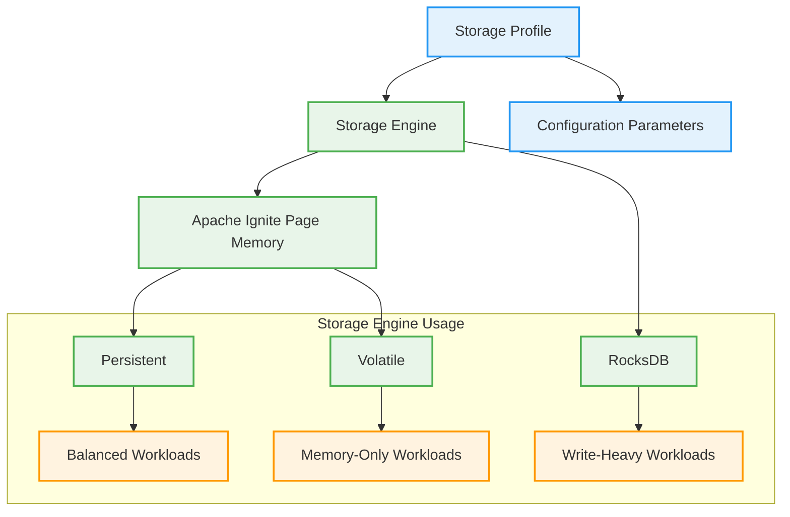

# Storage Profiles in Apache Ignite 3

This document explains the concept of storage profiles in Apache Ignite 3, their relationship with storage engines, and how to use them effectively.

## What Are Storage Profiles?

Storage profiles in Apache Ignite 3 define which storage engine to use and its configuration parameters. Storage profiles are a key component of the Ignite 3 architecture that:

- Define how data is physically stored
- Determine whether storage is persistent or volatile
- Configure storage engine-specific parameters
- Are associated with distribution zones and tables



## Supported Storage Engines

Apache Ignite 3 currently supports two main storage engines:

1. **Apache Ignite Page Memory (B+ tree)**
   - Available in two variants:
     - Persistent with in-memory caching layer
     - Fully in-memory (volatile)
   - Good for balanced workloads and read-intensive applications
   - Default engine for Ignite 3

2. **RocksDB (LSM-tree)**
   - Persistent only
   - Optimized for write-heavy workloads
   - Industry standard for high-write scenarios

## Performance Benchmarks

Here are some approximate performance characteristics of different storage profiles:

| Storage Profile | Engine | Read Performance | Write Performance | Space Efficiency | Use Case |
|-----------------|--------|------------------|-------------------|------------------|----------|
| default (persistent) | Page Memory | High | Medium | Medium | General purpose |
| in-memory | Page Memory | Very High | High | Low | High-speed caching |
| rocks-default | RocksDB | Medium | High | High | Write-intensive operations |

Note: Actual performance will vary based on hardware, data size, and access patterns.

## The Default Storage Profile

By default, Ignite 3 creates a storage profile named `default` that uses the persistent Apache Ignite Page Memory (aipersist) storage engine. This profile is suitable for most workloads and provides a good balance of read and write performance with data persistence.

## Relationship to Distribution Zones

Distribution zones must be configured with one or more storage profiles:

```java
// Create a distribution zone with the default storage profile
ZoneDefinition zoneChinook = ZoneDefinition.builder("Chinook")
        .ifNotExists()
        .replicas(2)
        .storageProfiles("default")
        .build();
```

Or in SQL:

```sql
CREATE ZONE IF NOT EXISTS Chinook 
WITH STORAGE_PROFILES='default', REPLICAS=2;
```

A distribution zone can be configured to use multiple storage profiles:

```sql
CREATE ZONE IF NOT EXISTS ExampleZone 
WITH STORAGE_PROFILES='profile1,profile2,profile3', REPLICAS=2;
```

### Storage Profiles in the Chinook Demo

In the Chinook Demo, both distribution zones use the `default` storage profile:

- The `Chinook` zone uses `default` for all main entity tables
- The `ChinookReplicated` zone also uses `default` for reference tables

The BulkLoadApp preserves this same storage profile configuration when creating tables using SQL.

## Assigning Storage Profiles to Tables

When creating a table, you specify which storage profile to use:

### Using SQL

```sql
CREATE TABLE Artist (
    ArtistId INT PRIMARY KEY,
    Name VARCHAR
) ZONE Chinook STORAGE PROFILE 'default';
```

### Using Java Annotations

```java
@Table(
        zone = @Zone(value = "Chinook", storageProfiles = "default")
)
public class Artist {
    @Id
    @Column(value = "ArtistId", nullable = false)
    private Integer artistId;

    @Column(value = "Name", nullable = true)
    private String name;
    
    // Methods omitted for brevity
}
```

## Creating Custom Storage Profiles

Storage profiles are configured at the node level. In a production environment, you would typically define custom storage profiles in the node configuration.

Using the CLI:

```bash
# Show current storage profiles
node config show ignite.storage.profiles

# Add a new profile using RocksDB
node config update "ignite.storage.profiles:{rocksProfile{engine:rocksdb,size:10000}}"

# Add a new in-memory profile
node config update "ignite.storage.profiles:{memoryProfile{engine:aipersist,persistent:false,size:1000}}"

# Restart the node for changes to take effect
```

## Tuning Storage Engine Parameters

You can configure storage engine parameters to optimize performance for your specific workload:

### Parameters for the aipersist Engine (Page Memory)

```bash
# Show current storage engine configuration
node config show ignite.storage.engines

# Update checkpoint frequency for aipersist engine
node config update ignite.storage.engines.aipersist.checkpoint.frequency = 16000

# Configure page size (in bytes)
node config update ignite.storage.engines.aipersist.page.size = 8192

# Set max memory allocation for page cache
node config update ignite.storage.engines.aipersist.memory.max = 1024m
```

### Parameters for the RocksDB Engine

```bash
# Configure RocksDB block cache size
node config update ignite.storage.engines.rocksdb.block_cache.size = 512m

# Set write buffer size
node config update ignite.storage.engines.rocksdb.write_buffer.size = 64m

# Configure compression
node config update ignite.storage.engines.rocksdb.compression = snappy
```

## Storage Profile Selection Guidelines

### When to Use Apache Ignite Page Memory (B+ tree)

- Balanced read/write workloads
- Read-heavy applications
- When you need both in-memory speed and persistence
- Default choice for most applications

### When to Use RocksDB (LSM-tree)

- Write-heavy workloads
- Log-based or time-series data
- When write performance is more critical than read performance
- When dealing with high volumes of small writes

### Volatile vs. Persistent Storage

- **Volatile (in-memory only)**:
  - Fastest performance
  - Data is lost on cluster restart
  - Good for caching, temporary data, or when backed by another persistence layer
  - Configure with `persistent:false` parameter

- **Persistent**:
  - Data survives cluster restarts
  - Slightly lower performance than pure in-memory
  - Good for most production use cases
  - Default configuration for most profiles

## Testing Different Storage Profiles

To compare performance between different storage profiles, you can create a simple test environment:

1. Create different distribution zones with different storage profiles:

```java
// Create a zone with default storage profile
ZoneDefinition zoneDefault = ZoneDefinition.builder("TestDefault")
        .replicas(2)
        .storageProfiles("default")
        .build();
client.catalog().createZone(zoneDefault);

// Create a zone with RocksDB profile (if configured)
ZoneDefinition zoneRocks = ZoneDefinition.builder("TestRocks")
        .replicas(2)
        .storageProfiles("rocks-profile")
        .build();
client.catalog().createZone(zoneRocks);
```

2. Create identical tables in each zone:

```java
// Create tables with identical structure in different zones
client.sql().execute(null,
    "CREATE TABLE Test_Default (id INT PRIMARY KEY, value VARCHAR) " +
    "ZONE TestDefault STORAGE PROFILE 'default'");

client.sql().execute(null,
    "CREATE TABLE Test_Rocks (id INT PRIMARY KEY, value VARCHAR) " +
    "ZONE TestRocks STORAGE PROFILE 'rocks-profile'");
```

3. Run performance tests against each table:

```java
// Write performance test
long startTime = System.currentTimeMillis();
for (int i = 0; i < 10000; i++) {
    client.sql().execute(null,
        "INSERT INTO Test_Default VALUES (?, ?)", i, "Value " + i);
}
long defaultWriteTime = System.currentTimeMillis() - startTime;

// Repeat for other table and read tests
```

4. Compare results to determine the best profile for your workload.

## Storage Profile Limitations and Considerations

1. A table can only use one storage profile
2. Once a table is created, its storage profile cannot be changed
3. Storage profiles must be defined before they can be used in a distribution zone
4. All nodes in the cluster should have the storage profiles defined in their configuration
5. Different storage engines have different memory and disk space requirements

## Example Use Cases

### Case 1: Mixed Workload System

- **Frequently accessed reference data**: Volatile Page Memory
  - Example: Genre and MediaType tables in Chinook
  - Configuration: In-memory storage profile
  - Benefit: Fastest possible read performance

- **Transaction data**: Persistent Page Memory
  - Example: Artist, Album, and Track tables in Chinook
  - Configuration: Default storage profile (persistent)
  - Benefit: Balance of read/write performance with durability

- **High-volume log data**: RocksDB
  - Example: System logs, audit trails
  - Configuration: RocksDB storage profile
  - Benefit: Optimized for sequential writes and high compression

### Case 2: Time-Series Database

- **Recent/hot data**: Persistent Page Memory
  - Example: Real-time metrics from the last 24 hours
  - Configuration: Default storage profile with larger memory allocation
  - Benefit: Fast access to recent data

- **Historical/cold data**: RocksDB
  - Example: Metrics older than 24 hours
  - Configuration: RocksDB storage profile
  - Benefit: Better compression and efficient storage of historical data

## Integration with BulkLoadApp

When using the BulkLoadApp to load data from SQL files, storage profiles are specified in the `CREATE TABLE` statements:

```sql
-- Create a table with default storage profile
CREATE TABLE Artist (
    ArtistId INT PRIMARY KEY,
    Name VARCHAR
) ZONE Chinook STORAGE PROFILE 'default';

-- Create a table with custom storage profile
CREATE TABLE LogEntry (
    Id BIGINT PRIMARY KEY,
    Timestamp TIMESTAMP,
    Message VARCHAR
) ZONE Logs STORAGE PROFILE 'rocksdb-profile';
```

The BulkLoadApp preserves these storage profile assignments when executing the SQL statements, ensuring that tables are created with the appropriate storage configuration.

## Further Reading

- [Storage Profiles and Engines Documentation](https://ignite.apache.org/docs/ignite3/latest/administrators-guide/storage)
- [Distribution Zones in Ignite 3](./distribution-zones-doc.md)
- [Configuring Storage in Ignite 3](https://ignite.apache.org/docs/ignite3/latest/administrators-guide/config/storage/persistent)
- [Bulk Loading in Ignite 3](./bulk-load-doc.md)
- [POJO Mapping in Ignite 3](./pojo-mapping-doc.md)
